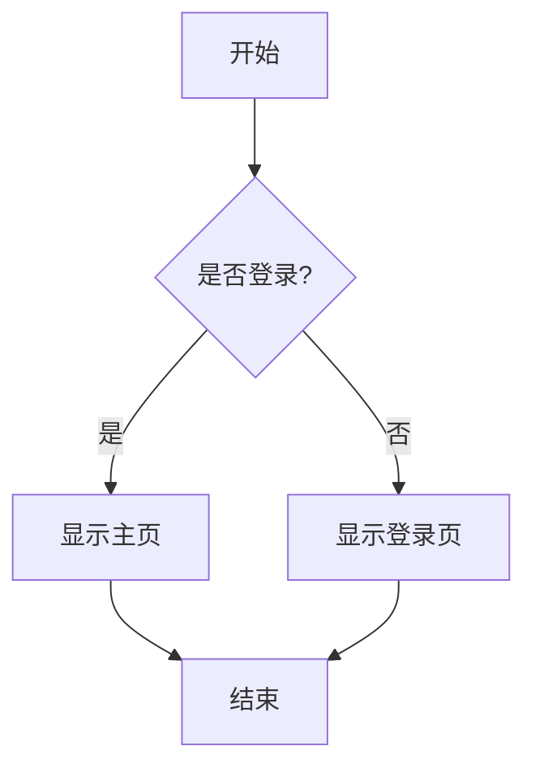
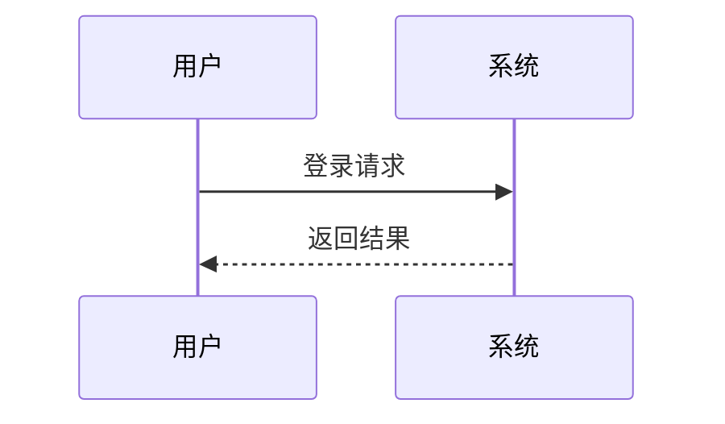

# 安装和使用指南

## 1. 安装插件

### 方法一：从 npm 安装（发布后）

```bash
cd your-hexo-blog
npm install hexo-mermaid-diagram --save
```

### 方法二：本地开发安装

```bash
# 在插件目录
cd /Users/gjx/Projects/hexo-mermaid-diagram
npm link

# 在你的 Hexo 博客目录
cd /path/to/your/hexo/blog
npm link hexo-mermaid-diagram
```

## 2. 配置插件

在你的 Hexo 博客的 `_config.yml` 文件中添加：

```yaml
# Mermaid Diagram 配置
mermaid_diagram:
  version: "11.12.2" # Mermaid.js 版本
  theme: "default" # 主题: default, neutral, dark, forest, base
  class_name: "mermaid-diagram" # CSS 类名前缀
  zoom: true # 启用点击放大功能
```

## 3. 使用插件

在你的 Markdown 文件中使用 mermaid 代码块：

````markdown
---
title: 我的文章
date: 2024-01-01
---

# 流程图


````

# 时序图



````

## 4. 验证安装

1. 启动你的 Hexo 博客：
   ```bash
   hexo clean
   hexo generate
   hexo server
````

2. 访问包含 mermaid 图表的页面

3. 检查页面源码，应该看到：
   - 原始代码块被替换为 `mermaid-diagram-container`
   - 包含 fallback 和 iframe 结构
   - 注入了相应的 CSS 和 JavaScript

## 5. 特性说明

### 渐进增强

- **JavaScript 启用时**：显示交互式图表
- **JavaScript 禁用时**：显示原始代码，用户可以展开查看

### 安全性

- 使用 iframe 隔离用户内容
- 防止 XSS 攻击
- sandbox 属性限制 iframe 权限

### 响应式设计

- 自动适配不同屏幕尺寸
- 支持深色模式
- iframe 高度自动调整

### 点击放大

- 可配置的点击放大功能
- 支持在覆盖层中查看大图

## 6. 故障排除

### 图表不显示

1. 检查控制台是否有 JavaScript 错误
2. 确认网络连接（需要加载 Mermaid.js CDN）
3. 检查 mermaid 语法是否正确

### 样式问题

1. 检查 CSS 是否被主题覆盖
2. 尝试调整 `class_name` 配置
3. 检查深色模式设置

### 性能问题

1. 考虑减少页面中的图表数量
2. 使用 CDN 加速 Mermaid.js 加载
3. 启用浏览器缓存

## 7. 开发和调试

### 本地测试

```bash
cd /Users/gjx/Projects/hexo-mermaid-diagram
node test.js
```

### 查看生成的 HTML

生成的 HTML 结构如下：

```html
<div class="mermaid-diagram-container">
  <div class="mermaid-diagram-wrapper">
    <!-- 降级方案 -->
    <details class="mermaid-diagram-fallback">
      <summary>View Mermaid diagram code</summary>
      <pre><code class="language-mermaid">...</code></pre>
    </details>

    <!-- iframe 渲染 -->
    <div class="mermaid-diagram-iframe-container">
      <iframe src="data:text/html;...">
    </div>
  </div>
</div>
```

### 自定义样式

你可以在主题的 CSS 文件中覆盖插件样式：

```css
.mermaid-diagram-wrapper {
  border: 2px solid #your-color;
  border-radius: 8px;
}

.mermaid-diagram-iframe {
  min-height: 300px;
}
```
